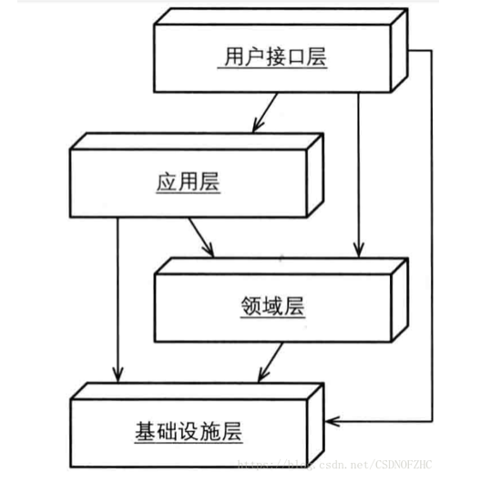
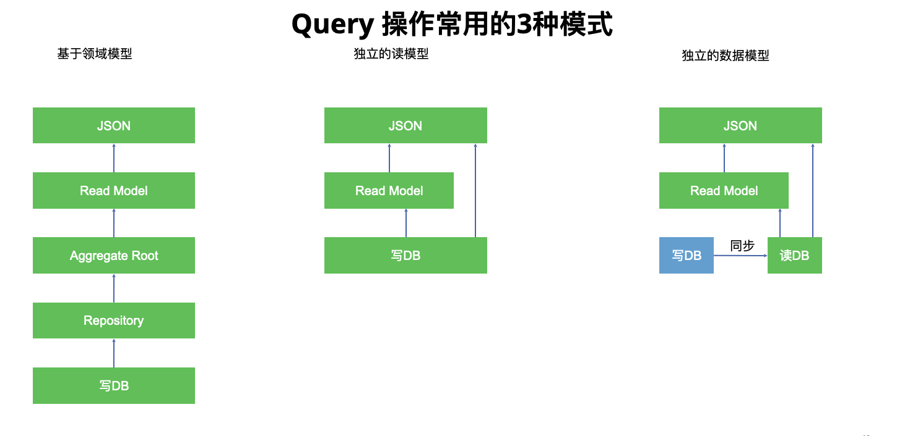

# DDD Practice

## 说明
---
本架构采用DDD经典4层架构，并通过Gradle的子模块进行划分：

### 用户接口层
 对应representation模块，包含RESTful接口及传递给client的DTO对象。  
### 应用层
 对应application模块，采用读写分离策略，Application Service分为ReadService和WriteService。 ReadService可以直接读取jpa对象，也可以读取domain对象，（建议直接读取jpa对象，减少对象转换，能够按需支持多做返回结构），WriteService必须通过Domain层进行操作，保证业务一致性。

### 领域层
 对应Domain模块，按照DDD战术实践实现，通过Archiunit进行架构守护，
 目前约束的规则包括：  
1. domain层不得依赖于任何其他层  
2. 聚合根不得存在公开的构造函数，且构造函数只能被领域工厂访问  
3. 实体不得存在公开的构造函数，且构造函数只能被聚合根访问  
4. 实体中的写方法只能被聚合根访问  
5. Domain层中的所有对象必须标注 以下注解：  
> *  AggregateRoot: 聚合根  
*  DomainEntity: 实体  
*  ValueObject: 值对象   
*  DomainFactory: 领域工厂，用来创建领域对象  
*  DomainPolicy: 领域策略，如折扣策略  
*  DomainPolicyImpl: 领域策略具体实现，如折扣策略中的买一赠一  
*  DomainException: 领域异常  
*  DomainEvent: 领域事件  
*  DomainService: 领域服务，用来处理跨聚合根操作   
 
6 其他注解说明： 
> 
* Invariant: 业务不变性，表示需要遵循的业务规则，用与方法
* Invariant: 业务不变性规则集，表示需要遵循的业务规则集，用与领域对象，表示该领域对象需要维护的业务规则 

### 基础设施层
对应infrastructure模块，目前存放了Jpa相关存储层信息。

## 命名规范
对于存储层对象，统一采用PO后缀命名  
聚合跟，实体统一不加后缀
领域值对象统一采用VO后缀(Domain层可采用VO对象接受外界参数)    
数据传输对象统一采用DTO后缀命名

ApplicationService统一命名以\*\*\*ReadService, \*\*\*WriteService或\*\*\*ApplicationService为后缀。   
其他Service均为DomainService   

JpaRepository统一以Jpa\*\*\*Repository命名    
DomainRepository统一以\*\*\*Repository命名，不带Jpa前缀    
DomainRepositoryImpl统一以\*\*\*RepositoryImpl命名，不带Jpa前缀    

